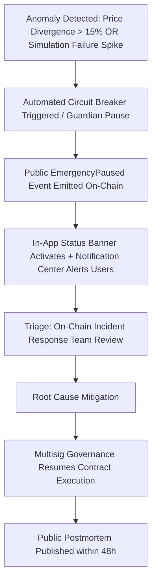

# §69 Multisig Key Ceremony & §70 Incident Response Runbook

## 1. §69 Treasury Key Ceremony Protocol

### Multisig Requirements
- Threshold: **4-of-7 multisig** for protocol governance and fee management.
- Geographic & Hardware Diversity: Signers distributed across minimum 3 distinct continents. Hardware wallets (Ledger/Trezor) generated in air-gapped ceremonies.
- Zero Hot Keys: Automated backend services NEVER hold treasury private keys.

### Rotation Cadence
- Scheduled rotation drill every 6 months.
- Mandatory rotation within 24 hours of any signer offboarding.

---

## 2. §70 Circuit Breaker & Emergency Runbook

### Trigger Conditions
1. **Abnormal Price Deviation**: Quoted pool price deviates $>15\%$ from Chainlink / Pyth oracle aggregate.
2. **Simulation Failure Cascade**: $>25\%$ consecutive pre-flight simulation reverts within a 60-second window.
3. **RPC Partition**: Divergence detected across $>2$ independent RPC providers.

### Safe Failure Principle
Pausing halts new swap routing. Under no circumstance does pausing lock, freeze, or confiscate user funds in wallets or transit.
